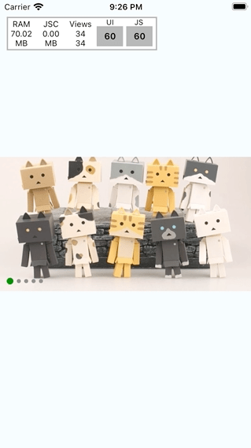
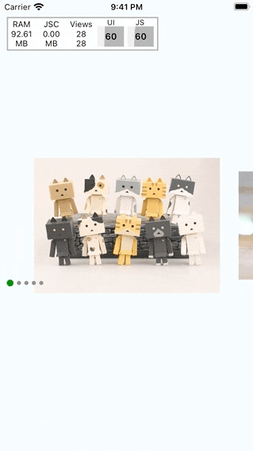
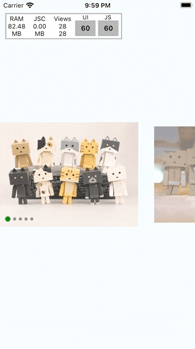

# react-native-carousel

## Getting started

`$ yarn add @r0b0t3d/react-native-carousel`

Note: Currently, I am using `react-native-reanimated` for animation. So you should install it as well

`$ yarn add react-native-reanimated`

## Breaking changes
Version 2.0.0 requires `react-native-reanimated@2.1.0`

## Show cases

| Loop | Scale | Alignment |
| -----| ----- | --------- |
|  |  |  |
### Loop
```tsx
<Carousel
  loop={true}
  autoPlay={true}
  duration={3000}
  animation="parallax"
/>
```

### Scale
```tsx
<Carousel
  itemWidth={width - 100}
  inactiveOpacity={0.5}
  inactiveScale={0.9}
/>
```

### Alignment
```tsx
<Carousel
  itemWidth={width - 100}
  inactiveOpacity={0.5}
  inactiveScale={0.9}
  firstItemAlignment="start"
/>
```
## Usage
```javascript
import Carousel from '@r0b0t3d/react-native-carousel';

<Carousel
    style={{ height: 200 }}
    data={data}
    loop
    autoPlay
    animation="parallax"
    renderImage={(item) => {
        return <Image
            style={{
                flex: 1,
                backgroundColor: 'red',
            }}
            source={{ uri: item.url }}
        />
    }}
/>
```

## Properties

| Props | Description | Default |
| ----- | ----------- |:-------:|
| data | array of item to be rendered.<br>- `id: string`: this will be used as key to render<br>- `source: ImageSourcePropType`: optional. Image source. If you don't want to pass `source` here. You could use `renderImage` below to render your custom image.|
|loop?| Whether your carousel can loop or not | false |
|autoPlay?| Auto animate to next image with `duration`.| false|
|duration?| duration to animate. used with `autoPlay` above|1000|
|animation?| predefined animation. Will be `parallax` for now||
|sliderWidth?| define slider width | screen's width |
|itemWidth?| define item width | screen's width |
|useIndicator?| use built-in indicator component | true |
|inactiveOpacity?| [0 - 1] define opacity for inactive items | 1 |
|inactiveScale?| [0 - 1] define scale value for inactive items | 1 |
|spaceBetween?| add additional space between items | 0 |
|indicatorContainerStyle?| style for indication container | |
|renderIndicator?| `({ selected, index }: { selected: boolean, index: number }) => React.ReactNode`<br> custom render for indicator | |
|renderImage?| `(item: CarouselData) => React.ReactNode`<br> custom image render. | |
|renderOverlay?| `(item: CarouselData) => React.ReactNode`<br> render custom overlay above image | |
|onPageChange?| `(item: CarouselData, index: number) => void`<br> callback to notify when page change | |

## Contributing

See the [contributing guide](CONTRIBUTING.md) to learn how to contribute to the repository and the development workflow.

## License

MIT